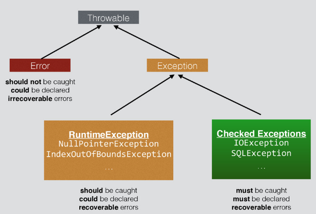

## 자바의 예외(Exception)

## 1. 예외 vs 에러

예외: 입력값에 대한 처리가 불가능 하거나, 프로그램 실행 중에 참조된 값이 잘못된 경우 등 정상적인 프로그램의 흐름을 어긋나는 것

에러: 시스템에 비정상적인 상황이 발생한 경우, 이를 애플리케이션 코드에서 잡을 수 없다.

## 2. 예외 종류

- Checked Exception (Runtime Exception 계열이 아닌 예외)(ex. SQLException, IOException, FileNotFoundException..)
- Unchecked Exception (Runtime Exception 계열의 예외)(ex. NullPointerException, ArithmeticException..)

1. Checked Exception은 개발자가 반드시 예외 처리를 해주어야함.
   (컴파일 시 예외가 확인됨)
2. Checked Exception은 트랜잭션 처리 시 예외 발생하면 롤백하지 않는다.(스프링)

---

1. Unchecked Exception은 명시적으로 예외 처리할 필요가 없으며, 런타임 시점에 예외 발생이 확인 됨.
2. Unchecked Exception은 트랜잭션 처리 시 예외 발생하면 롤백을 수행한다.(스프링)

## 3. 예외 처리 방법

복구(try - catch), 회피(throws), 전환(적절한 예외로 전환)

1. 복구
   예외 상황을 파악하고 문제를 해결해서 정상 상태로 돌려놓는 방법
   예외를 잡아서 일정 시간, 조건만큼 대기하고 다시 재시도를 반복한다.
   최대 재시도 횟수를 넘기게 되는 경우 예외를 발생시킨다.

2. 회피
   예외 처리를 직접 담당하지 않고 호출한 쪽으로 던져 회피하는 방법
   그래도 예외 처리의 필요성이 있다면 어느 정도는 처리하고 던지는 것이 좋다.
   긴밀하게 역할을 분담하고 있는 관계가 아니라면 예외를 그냥 던지는 것은 무책임하다.

3. 전환
   예외 회피와 비슷하게 메서드 밖으로 예외를 던지지만, 그냥 던지지 않고 적절한 예외로 전환해서 넘기는 방법
   조금 더 명확한 의미로 전달되기 위해 적합한 의미를 가진 예외로 변경한다.
   예외 처리를 단순하게 만들기 위해 포장(wrap) 할 수도 있다.
