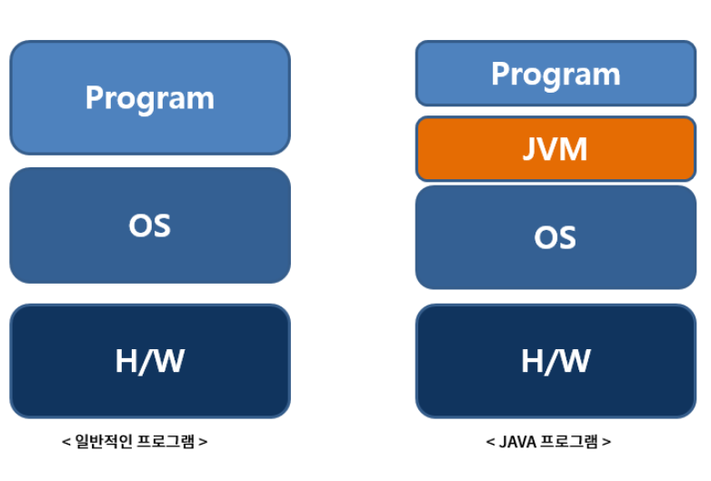
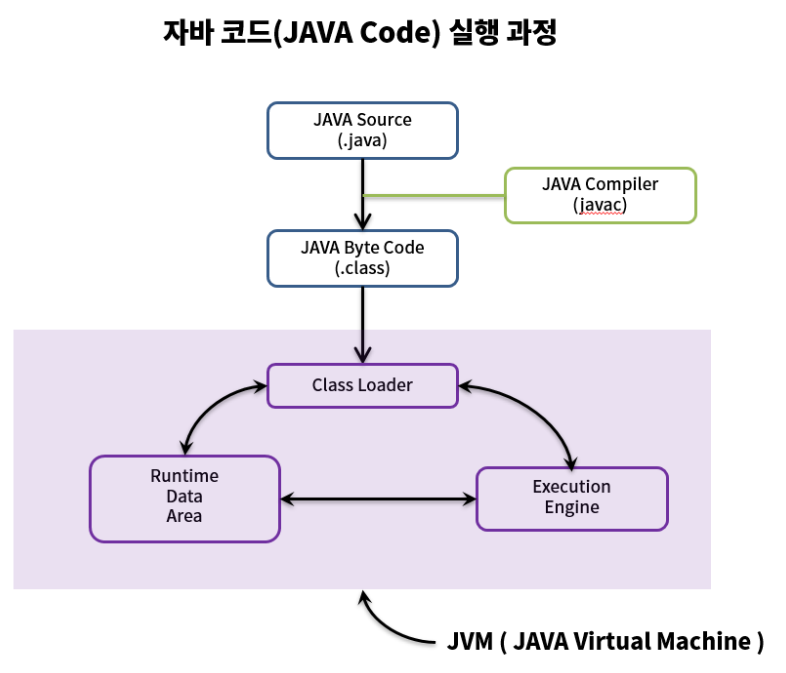
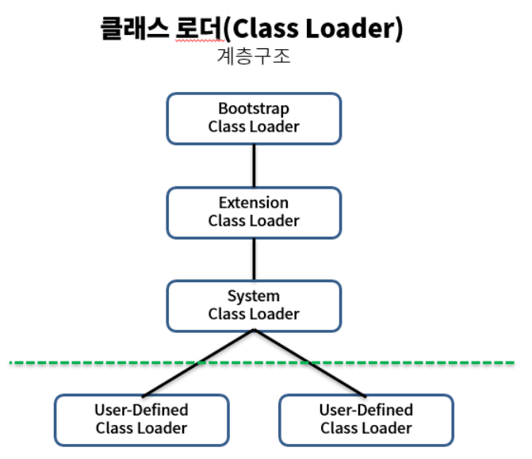

## 자바의 특징

컴파일된 코드(바이트코드)가 플랫폼 독립적.

## 자바 코드 실행과정

1. .java파일을 자바 컴파일러(javac)를 통해 자바 바이트 코드로 컴파일
2. 컴파일된 바이트코드를 JVM의 클래스로더에게 전달
3. 클래스로더는 동적로딩을 통해 필요한 클래스들을 로딩 및 링크하여 런타임 데이터영역, JVM메모리에 올림.
4. 실행엔진은 JVM메모리에 올라온 바이트 코드들을 명령어 단위 하나씩 가져와서 실행.

## JVM동작원리

클래스로더, 런타임 데이터 영역, 실행엔진에 대해 알아야함.

1. Class Loader를 통해 .class 파일들을 JVM에 올린다
2. JVM에 있는 .class 파일들을 Execution Engine의 Interpreter와 JIT Complier를 통해 해석된다
3. 해석된 바이트 코드는 Runtime Data Areas 에 배치되어 실질적인 수행이 이루어진다

### 클래스 로더

### 런타임 데이터 영역

### 실행엔진

## 정리

\*.java가 자바 컴파일러에 의해 .class로 변환된다
.class가 Class Loader로 인해 JVM에 로딩된다
JVM의 인터프리터와 JIT 컴파일러에 의해 변환된 코드가 실행된다
