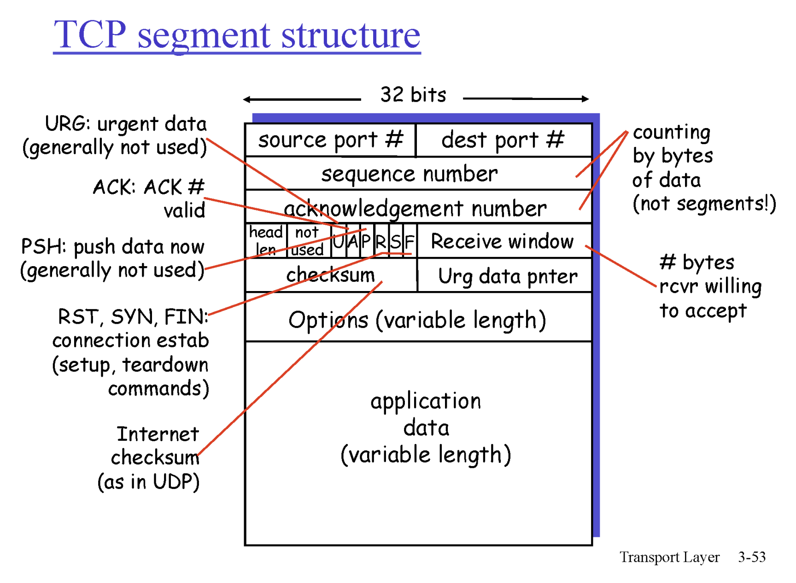
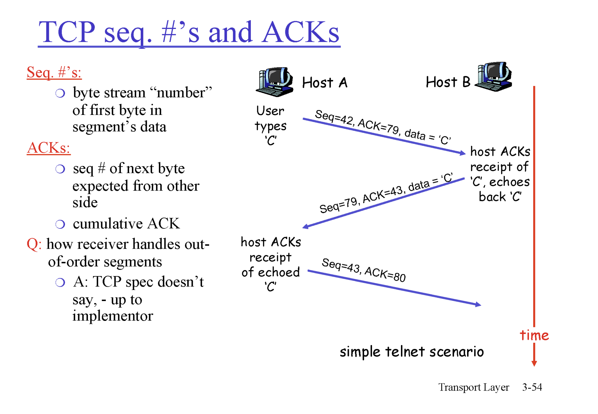
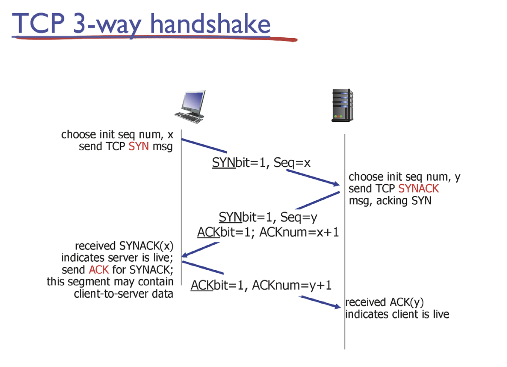
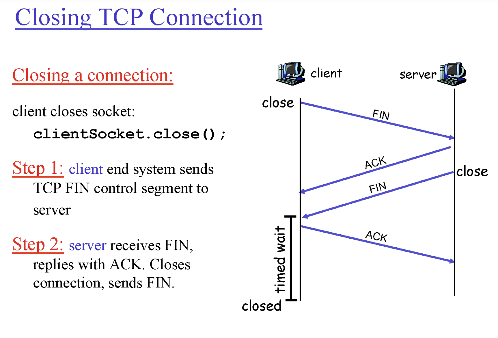
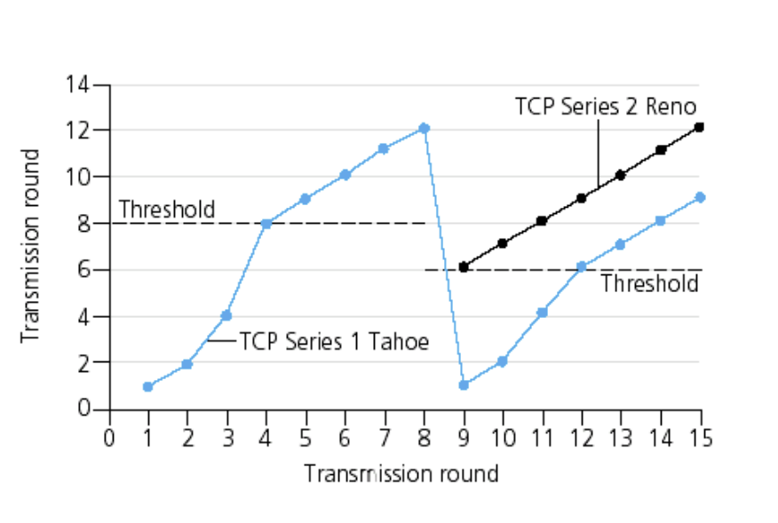
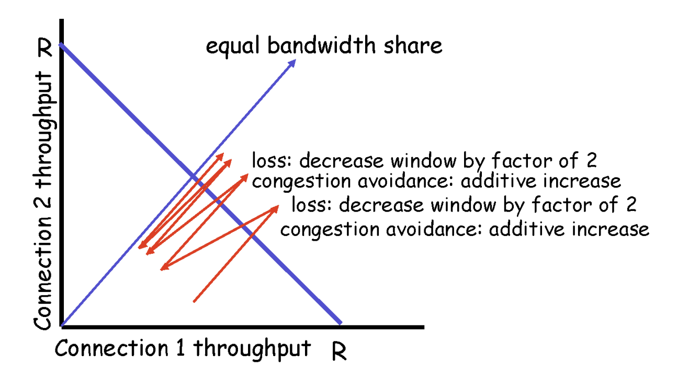

## TCP/IP의 개념

TCP/IP는 패킷 통신 방식의 인터넷 프로토콜인 IP와 전송 제어 프로토콜인 TCP로 이루어져 있다.
IP는 패킷 전달 여부를 보증하지 않고, 패킷을 보낸 순서와 받는 순서가 다를 수 있다.
반면, TCP는 IP위에서 동작하는 프로토콜로 데이터의 전달을 보증하고 보낸 순서대로 받게 해준다.

따라서,
## 데이터의 정확성 확인은 TCP가 수행하고 패킷을 목적지까지로 전송은 IP가 담당한다.

그러면 TCP와 IP의 수행방식은 무엇일까??
TCP는 전송제어 프로토콜로 신뢰성이 없는 인터넷을 통해 종단간에 신뢰성 있는 바이트 스트림을 전송하도록
특별히 설계되었다. TCP는 송신자와 수신자 모두가 소켓이라고 부르는 종단점을 생성함으로써
이루어진다. TCP에서 연결 설정은 3-way handshake를 통해 이루어진다.

TCP는 가상 회선을 만들어 신뢰성을 보장하도록(흐름 제어, 혼잡 제어, 오류 제어) 하는 프로토콜로 
따로 신뢰성을 보장하기 위한 절차가 없는 UDP에 비해 속도가 느린편이다.

## TCP의 특징
1. point - to - point : 한 쌍의 소켓끼리의 통신을 책임진다.
2. reliable, in-order byte stream: 신뢰성있고, 순서가 보장된다.
3. pipelined: window (한번에 쏟아붓기)
4. 양방향 통신
5. flow-controlled: receiver가 받을 수 있는 능력만큼 sender가 send
6. congestion control

데이터의 전송 단위
1. APPLICATION 계층 - Message
2. TCP 계층 - Segment(TCP Header + Data) (여기서 Data는 Application의 Message)
3. IP 계층 - Packet(IP Header + Data) (여기서 Data는 TCP계층의 Segment)
4. Link 계층 - Frame(Link Header + Data) (여기서 Data는 IP계층의 Packet)

## TCP 세그먼트의 구조

## TCP의 동작

TCP헤더의 Seq번호의 의미: 현재 세그먼트의 데이터의 가장 첫번째 byte의 번호
TCP헤더의 ACK번호의 의미: 예를들어 79라면 78번까지는 잘 받았고, 79번 byte를 기다릴꺼야.

데이터 유실 판단 ? TIME OUT
FEEDBACK이 오면 OK
아니면 데이터 유실 판단

그러면 TIMEOUT VALUE를 어느정도로 설정?
작게하면 reaction은 빠른대신 overhead
역은 반대

적당히 잘 잡아야함.

Round Trip Time : 어떤 세그먼트가 송신자로부터 출발해서 다시 돌아오는데 걸리는 시간 RTT
RTT보다 시간이 더 걸리면 유실, 아니면 ok

timeout = RTT로 판단?
RTT는 다 다름 (지나가는 경로가 다 다르기 때문에, 큐잉딜레이)

대표할만한 RTT값을 측정해 평균. EstimatedRTT  
실제로 사용하는 timeout 값: EstimatedRTT + DevRTT*4

## TCP의 동작방식
- Application 계층에서 데이터를 받은 후 TCP 헤더에 감싸 패킷을 만든다.
- TCP 헤더는 송신지 포트주소, 수신지 포트주소, Checksum 등의 정보를 포함한다.
- 송신지와 수신지의 TCP 연결을 위해 3-way handshake (SYN, SYN+ACK, ACK)
- 연결이 되었다면 데이터 송수신
- TCP 연결 해제를 위해 4-way handshake (FIN, ACK, FIN, ACK)

## 어떻게 신뢰성 있는 통신을 보장하는걸까?
1. 데이터의 유실이 있을 때 - ACK가 Timeout 시간동안 오지 않았다면 송신측에서 재송신
2. 받은 패킷에 오류가 있을 때 - TCP 헤더의 CHECKSUM을 통해 오류 검출
3. 순서는 어떻게? - 받은 데이터의 순서가 뒤죽박죽이더라도 TCP 헤더의 SEQ#가 있어 이를 순서대로 조립하기만 하면됨.

## Timeout 시 에러정정 방법
1. Stop and Wait : 패킷 한 개씩 timeout시 ack를 받지 못한 패킷부터 기다렸다가 재전송(비효율적)
2. Go Back N: timeout시 ack를 받지 못한 패킷부터 '모두' 재전송(비효율적)
3. Selective and Repeat: ack를 받지 못한 패킷만을 선택적으로 재전송

송/수신자의 각각 Window 사이즈만큼 즉, 수용가능한 만큼을 보냄

- TCP reliable data transfer
1. timer 1개 씀
2. 파이프라인 segments
3. Cumulative ACKs

- fast retransmit 매커니즘
receiver의 ack가 연속으로 3번 같은 번호를 보내면 데이터 유실 판단 가능하다고 보는 매커니즘(총 4번임)
더 빠르게(효율적으로) 동작하게끔 하는 옵션 기능

## 3-way handshake(접속 시작)

마지막 3번째 handshake때 data포함될 수 있음.

## 4-way handshake(접속 끊기)

## TCP Congestion Control
- slow start: 처음에 가장 적은 양으로 시작
- additive increase: 임계점을 지났을 때는 선형적으로 늘려나감
- multiplicative decrease: packet loss가 발생하면 window-size를 절반으로 떨어뜨림

sender의 보내는 양은 Math.min(Network의 수용가능양, receiver의 수용가능양)에 따라가야함.
Network의 상황은 어떻게 판단? -> congestion control
1. End-End congestion control (현재 사용되는 방식)
2. Network-assisted congestion control (현재 구현 x)

MSS(Maximum Segment Size): 세그먼트 하나는 최대 500Byte 크기를 가질 수 있음.
rate = CongestionWindow / RTT (Byte/sec)

### End-End congestion control 방식

현재는 Reno 방식을 사용

TCP는 결과적으로 모든 사람에게 공평하게 수렴한다.

