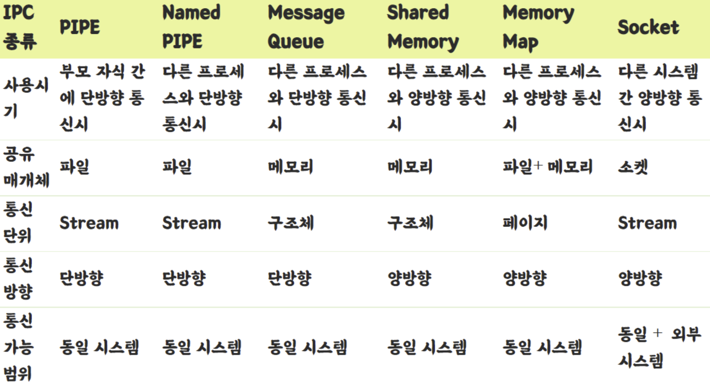

### IPC

1. IPC가 무엇인지 설명해주세요.
   프로세스끼리는 완전한 독립의 영역이어서 데이터 공유가 필요할때 프로세스간의 통신이 필요

2. 프로세스간 통신방법에 대해 설명해주세요.

-   메모리를 공유하는 방식
-   소켓을 이용한 방식
-   파이프를 이용한 방식
    

3. IPC는 왜 필요한지?
   독립되어 있는 프로세간 데이터 주고받는 행위를 위해 커널에서 IPC를 제공

4. IPC기능은 어디에서 제공되나요?
   커널영역
